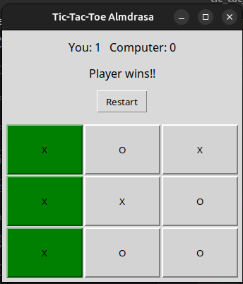

# tic-tac-toe-app

python tic-tac-toe(X, O) app with GUI using tkinter library

This is the second project of first stage of Almdrasa

## Table of contents

- [Overview](#overview)
  - [The challenge](#the-challenge)
  - [Screenshot](#screenshot)
  - [Links](#links)
- [My process](#my-process)
  - [Built with](#built-with)
  - [What I learned](#what-i-learned)

## Overview

This is tic-tac-toe(X, O) app with it's GUI using tkinter library.

### The challenge

- Player play this game against computer
- If user win message shown that he won
- If computer win message shown that he won
- If no one win message shown that it's a Tie.
- there is score to save progress.

### Screenshot

.

### Links

- Solution URL: [Solution URL](https://github.com/Mohammed-Abol-Fotouh/tic-tac-toe)

## My process

- I used miro for planning for this project
- I used the right libraries and API's to make this game
- I used chatGPT for code refactoring and enhancement

### Built with

- Python
- Python tkinter library
- random library for computer choice
- chatGPT for enhanced version of the project

### What I learned

- In this project i learned how to use tkinter library more.
