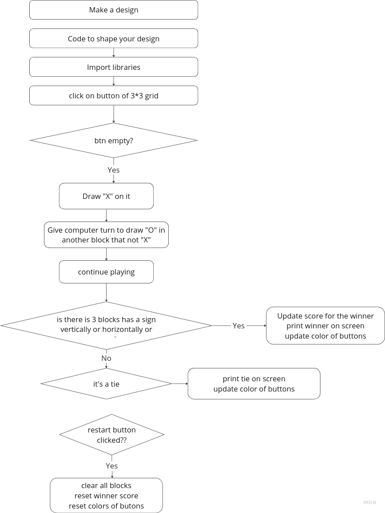

# Weather-app

python weather app with GUI using tkinter library

This is a project of first stage of Almdrasa

## Table of contents

- [Overview](#overview)
  - [The challenge](#the-challenge)
  - [Screenshot](#screenshot)
  - [Links](#links)
- [My process](#my-process)
  - [Built with](#built-with)
  - [What I learned](#what-i-learned)

## Overview

This is a weather app with it's GUI using tkinter library.

### The challenge

Users should be able to:

- Search for any city around the world to view it's weather.
- Know Temperature, Humidity, Wind speed, pressure and Precipitation for the selected citt around the world.

### Screenshot

.

### Links

- Solution URL: [Solution URL](https://github.com/Mohammed-Abol-Fotouh/Weather-app)

## My process

- I used miro for planning for this project
- I used the right libraries and API's to make the GUI and search for cities
- I used chatGPT for code refactoring and enhancement

### Built with

- Python
- Python tkinter library
- requests library for weather API
- chatGPT for enhanced version of the project

### What I learned

- In this project i learned how to use tkinter library
- How to implement API request
